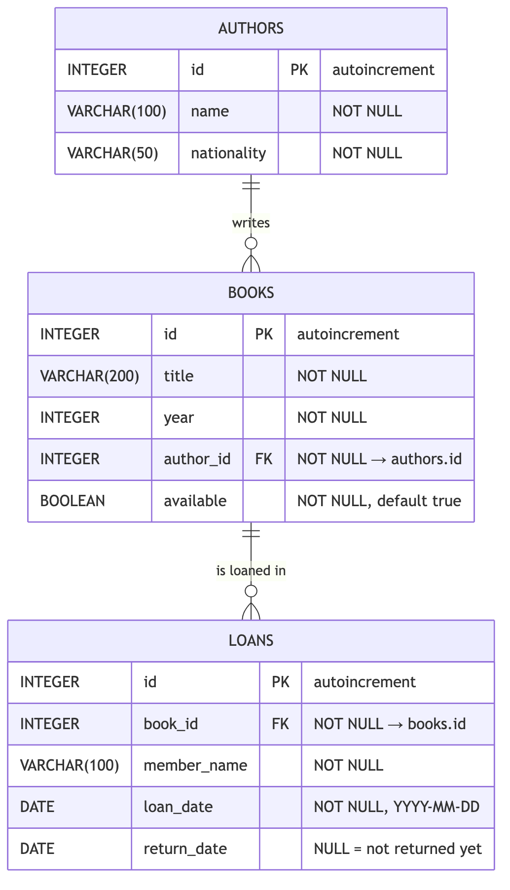
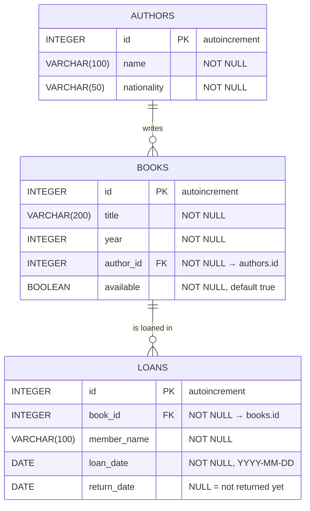

# Diagrama Entidad-Relación · Biblioteca

Este es el DER de la base de datos que se crea en PostgreSQL (base `library`) al correr `npm run seed`. Cada entidad es una tabla, y cada tabla es un modelo en `src/models/`.

El mismo diagrama en Mermaid, para editarlo si agregan tablas (se renderiza solo en GitHub y en la preview de VS Code):

## Cómo leerlo

**Relaciones**

| Relación | Cardinalidad | En palabras | En Sequelize (`models/index.ts`) |
|---|---|---|---|
| authors → books | 1 a N | Un autor escribe muchos libros. Un libro tiene exactamente un autor. | `Author.hasMany(Book)` · `Book.belongsTo(Author)` |
| books → loans | 1 a N | Un libro se presta muchas veces a lo largo del tiempo. Un préstamo es de un solo libro. | `Book.hasMany(Loan)` · `Loan.belongsTo(Book)` |

La notación de las patas de gallo: `||` es "exactamente uno", `o{` es "cero o muchos". Así, `AUTHORS ||--o{ BOOKS` se lee: un autor tiene cero o muchos libros, y cada libro pertenece a exactamente un autor.

**Claves**

- `PK` es la clave primaria. En las tres tablas es `id`, entero autoincremental.
- `FK` es una clave foránea: una columna que guarda el `id` de una fila de otra tabla. `books.author_id` apunta a `authors.id`, y `loans.book_id` apunta a `books.id`.

**Una decisión de diseño para discutir**

`books.available` es un dato **derivado**: en teoría se podría calcular preguntando si el libro tiene algún préstamo con `return_date` en `NULL`. Se guarda igual como columna para que `GET /books?available=true` sea una consulta simple. El costo es que la API tiene que mantenerlo sincronizado: cuando se crea un préstamo, el libro pasa a `available: false`; cuando se registra la devolución, vuelve a `true`. Esa es la regla de negocio de los préstamos (paso 5 de la práctica).

## Cómo se traduce a las otras dos vistas

| DER | Sequelize (`models/`) | OpenAPI (`docs/openapi.yaml`) | TypeScript (`types/`) |
|---|---|---|---|
| Entidad `BOOKS` | `class Book extends Model` | `components.schemas.Book` | `interface Book` |
| `title VARCHAR(200) NOT NULL` | `title: { type: DataTypes.STRING(200), allowNull: false }` | `title: { type: string, maxLength: 200 }` + en `required` | `title: string` |
| `return_date DATE NULL` | `allowNull: true` | `nullable: true` | `return_date: string \| null` |
| `author_id FK` | `Book.belongsTo(Author, { foreignKey: "author_id" })` | `author_id: { type: integer }` | `author_id: number` |

Son cuatro formas de escribir la misma forma de datos. Si cambiás una, tenés que cambiar las otras tres.
